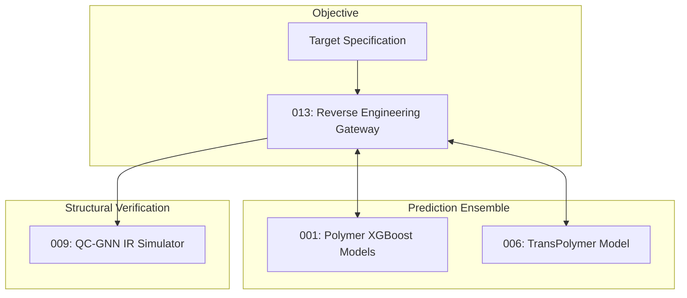

# 통합 표면 분석 플랫폼 - Step 3: 역설계 (SG_integration_step3)


## 1. 개요
Step 2에서 매칭되는 자사 제품이 없을 경우 구동되는 역설계 및 신규 고분자 배합 예측 플랫폼입니다. 타겟 물성을 입력받아 AI 피드백 루프를 통해 최적의 모노머 배합비를 도출하고, 해당 배합의 물리적 특성 및 분자 구조를 검증합니다.

## 2. 아키텍처 다이어그램


## 3. 주요 포함 모듈 (Git Submodule)
- **SG_proj_013**: 역설계 목표 설정 및 AI 앙상블 피드백 제어 게이트웨이
- **SG_proj_001**: 모노머 성분비에 따른 점착력, 점도, Tg 예측 (XGBoost)
- **SG_proj_006**: 딥러닝 기반 자유부피율(FFV), 열전도도 등 멀티태스크 예측
- **SG_proj_009**: GNN 기반 혼합물 IR 스펙트럼(cm⁻¹) 시뮬레이터

## 4. 실행 방법
```bash
git submodule update --init --recursive
streamlit run app.py
```
